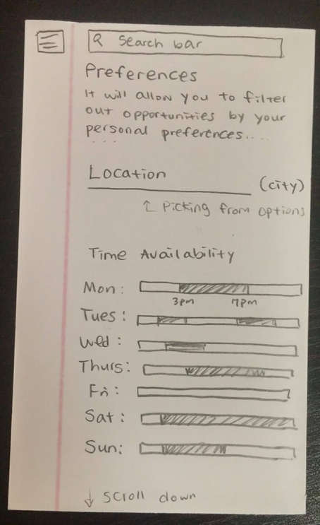
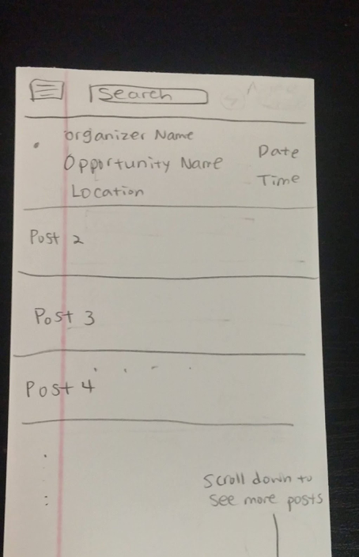
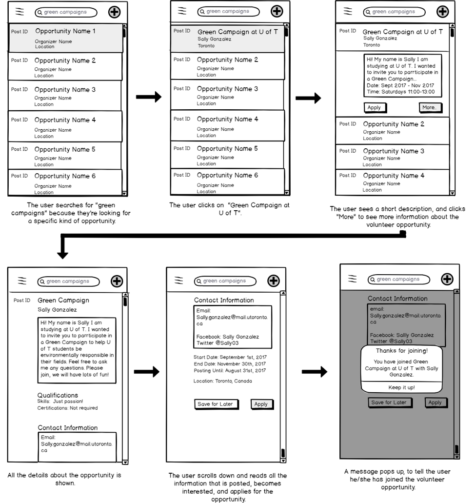

# The Story
---
The theme of social improvement is what my peers and I pondered one afternoon. We found that there was a difficulty in connecting individuals to volunteer positions in their area which catered towards their personal interests and skills. Thus, we began our design journey to create an effective yet functional mobile application to encourage individuals to volunteer using Volunteer Book.

# Research and Requirements
---
The first step in our design process was to outline the requirements of the mobile application which were generated by user interviews and categorized into three types: Functional, Data and Environmental requirements. The functional requirements were fundamental and focused on the goal of the mobile application, for example the user should be able to filter volunteer opportunities based on user preferences. Data requirements specified the data needed to be stored in the volunteer application such as a user’s profile information. Finally, environmental requirements show the circumstances in which the mobile application can operate, for example the user must be connected to Wi-Fi and/or cell phone reception.

Creation of a usability protocol followed a DECIDE framework which provided a guideline to usability testing later on in the design process.

# Design
---
**Initial Sketches**

After outlining the requirements of the projects, I continued onto creating initial sketches of the mobile application. To initiate a volunteer opportunity, the user would be able to filter their results and find a post which matches their preference, time availability and location.

**Low Fidelity Wireframes**

Using Balsamiq, low fidelity wireframes were created to have a visual and layout of how the mobile application may look. 
I decided to include an "Add Oportunity" button to the top navigation bar so it was easily accessible for users to create positings with minimal effort. The usage of an icon rather than words helped aid user recognition.

Clicking one of the search results will expand the post on the same page and will provide the user with a short description of the volunteer opportunity. This was an important feature to include to provide the user with more information on the posting efficiently, rather than being redirected to a different page each click. This would allow the user to scroll through postings since they can expand and collapse each posting with one click.

After the first iteration of design stage was finished, the application was evaluated using both formative and summative user testing. Two subjects were tested with the first iteration interfaces. Formative evaluation happened immediately after and usability problems were observed which included mis clicks and confusion of the icons.Three different subjects participated in user testing and summative evaluation was conducted such as recommended designed changes in the future.

**High Fidelity Prototype**

Using heuristic evaluation, recommended design changes were made to the low fidelity prototype. Users were asked to perform three tasks. Their performance of the task was then categorized into minor, moderate and critical issues which assisted in prioritizing which task of the app should be redesigned first. Following the final design iteration, qualitative data was gathered from users using an exit survey and a system usability scale was used to evaluate the entire mobile application.

The final design was created using Figma and InVision which incorporated the changes suggested after performing the evaluations.

  
  
 
# Conclusion and Thoughts
---
Design is one of the most important stages to any project. It helps provide a visual for the end product, reduces developing costs if issues are covered in the design process and allows for easy iteration. Usability tests and utilizing design frameworks allowed myself to make data driven decisions on how the design of the application and overall experience would be improved for the user.

**Tools and Frameworks Used:**

* Figma
* InVision
* DECIDE
* Semi-Structured Interviews
* System Usability Scale

--- 

