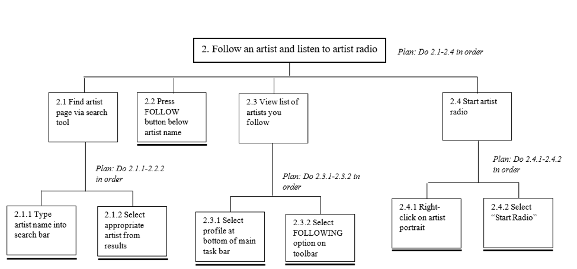
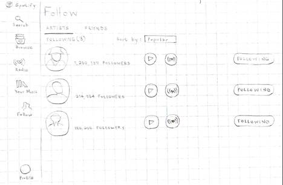

# The Story
---
One night while using Spotify's mobile application, I was interested in finding similar artisits to one of my most favourited artists. The issue was playing that artists radio was quite difficult. This motivated me to enhance the user experience and make it easier to listen to my favourite artist's radio.

# Task Analysis
---
To begin, a Hierarchical Task Analysis (HTA) was conducted where experienced Spotify users conducting a usability test. The HTAs that were created decompose the Spotify interface into its core functionalities, allowing further analysis of the individual subtasks involved with playing my favourite artists radio.

The HTA assisted in decomposing a large task into subtasks which was then analyzed in chunks.

# Design Sketch
---
The initial design of the mobile application was made using pencil and paper. One of the major changes was to add an artist favourite radio button under the follow section of the application. This would make it easy for users to favourite their artist radio. In the sidebar, the same icon is used for consistency and so artists radio is easily accessible.

**Tools and Frameworks Used:**
---
* Usability Testing
* Hierarchical Task Analysis
* Brainstorming
* Pencil + Paper
